# API Testing Report
## Card Collection REST API

---

**Submitted by:** Gurchetan Singh  
**Date:** March 7, 2026  
**API Base URL:** `http://localhost:3000`

---

## Table of Contents
1. Introduction
2. GET Endpoints Testing
3. POST Endpoints Testing
4. PUT Endpoints Testing
5. DELETE Endpoints Testing
6. Conclusion

---

## 1. Introduction

This report documents the comprehensive testing of the Card Collection REST API. All endpoints have been tested using Thunder Client/Postman to verify functionality, error handling, and data validation. The API provides full CRUD operations for managing a card collection.

---

## 2. GET Endpoints Testing

### 2.1 Welcome Message
**Endpoint:** `GET /`

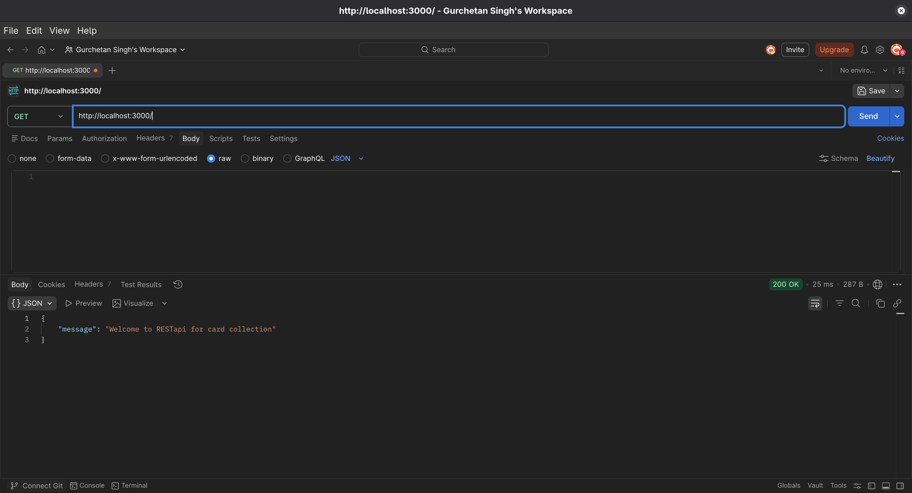

**Request:**
```
GET http://localhost:3000/
```

**Response:** (200 OK)
```json
{
  "message": "Welcome to RESTApi for card collection"
}
```

**Result:** ✅ Passed - Welcome message displayed correctly

---

### 2.2 Get All Cards
**Endpoint:** `GET /cards`

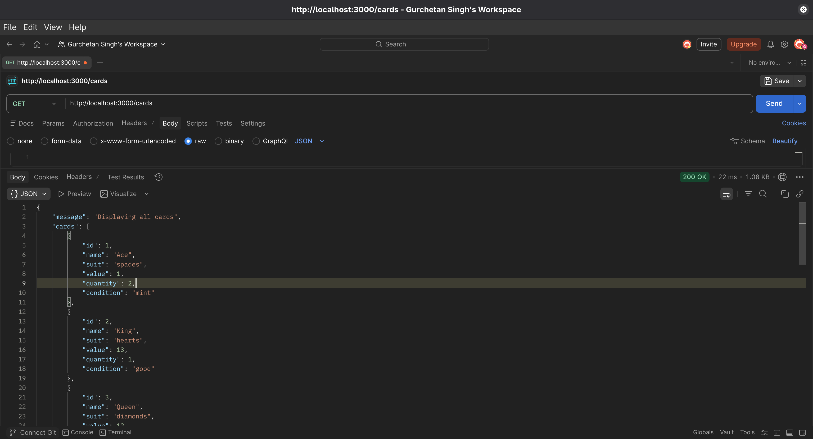

**Request:**
```
GET http://localhost:3000/cards
```

**Response:** (200 OK)
```json
{
  "message": "Displaying all cards",
  "cards": [
    {
      "id": 1,
      "name": "Ace",
      "suit": "spades",
      "value": 1,
      "quantity": 2,
      "condition": "mint"
    },
    {
      "id": 2,
      "name": "King",
      "suit": "hearts",
      "value": 13,
      "quantity": 1,
      "condition": "good"
    }
  ]
}
```

**Result:** ✅ Passed - All cards retrieved successfully

---

### 2.3 Get Card by ID
**Endpoint:** `GET /cards/:id`

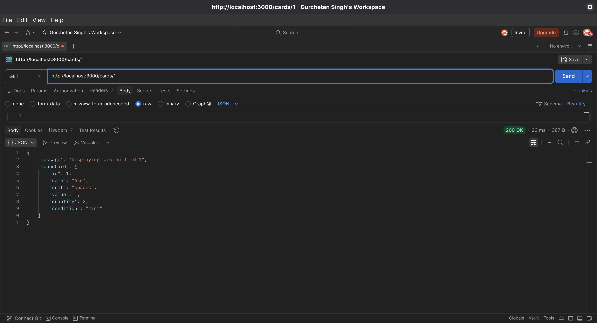

**Request:**
```
GET http://localhost:3000/cards/1
```

**Response:** (200 OK)
```json
{
  "foundCard": {
    "id": 1,
    "name": "Ace",
    "suit": "spades",
    "value": 1,
    "quantity": 2,
    "condition": "mint"
  }
}
```

**Result:** ✅ Passed - Correct card retrieved by ID

---

### 2.4 Get Cards by Suit (Valid Suit)
**Endpoint:** `GET /cards?suit=:suit`

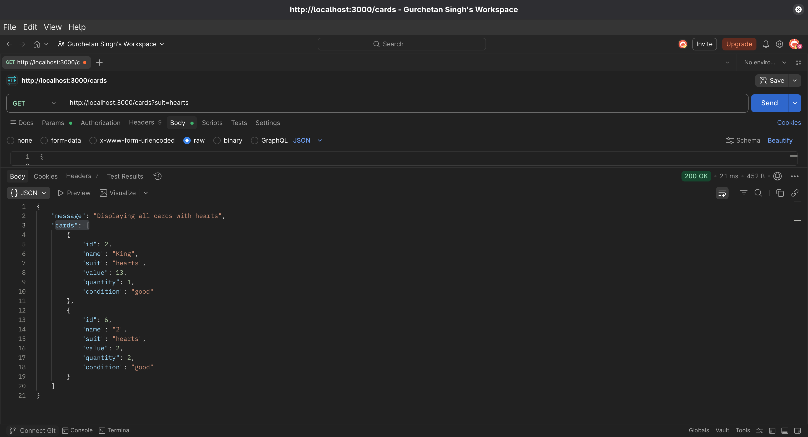

**Request:**
```
GET http://localhost:3000/cards?suit=hearts
```

**Response:** (200 OK)
```json
{
  "message": "Displaying all cards with hearts",
  "cards": [
    {
      "id": 2,
      "name": "King",
      "suit": "hearts",
      "value": 13,
      "quantity": 1,
      "condition": "good"
    },
    {
      "id": 6,
      "name": "2",
      "suit": "hearts",
      "value": 2,
      "quantity": 2,
      "condition": "good"
    }
  ]
}
```

**Result:** ✅ Passed - Cards filtered by suit correctly

---

### 2.5 Get Cards by Suit (Invalid Suit - Validation Test)
**Endpoint:** `GET /cards?suit=:suit`

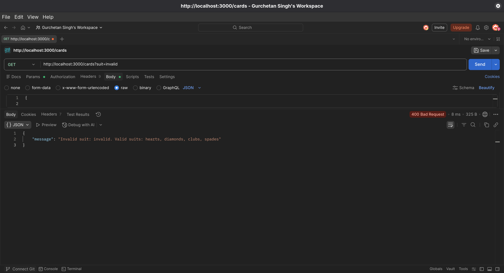

**Request:**
```
GET http://localhost:3000/cards?suit=invalid
```

**Response:** (400 Bad Request)
```json
{
  "message": "Invalid suit: invalid. Valid suits: hearts, diamonds, clubs, spades"
}
```

**Result:** ✅ Passed - Proper validation with helpful error message

---

### 2.6 Get Card by Non-existent ID
**Endpoint:** `GET /cards/:id`

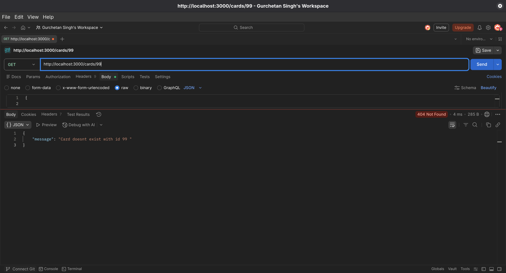

**Request:**
```
GET http://localhost:3000/cards/99
```

**Response:** (404 Not Found)
```json
{
  "message": "Card doesn't exist with id 99"
}
```

**Result:** ✅ Passed - Proper 404 error handling

---

## 3. POST Endpoints Testing

### 3.1 Create New Card (Valid Data)
**Endpoint:** `POST /cards`

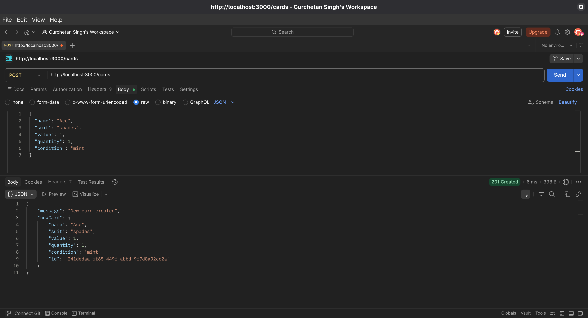

**Request:**
```
POST http://localhost:3000/cards
Content-Type: application/json

{
  "name": "Ace",
  "suit": "spades",
  "value": 1,
  "quantity": 1,
  "condition": "mint"
}
```

**Response:** (201 Created)
```json
{
  "message": "New card created",
  "newCard": {
    "name": "Ace",
    "suit": "spades",
    "value": 1,
    "quantity": 1,
    "condition": "mint",
    "id": "241dedaa-6f65-449f-abbd-9f7d8a92cc2a"
  }
}
```

**Result:** ✅ Passed - Card created successfully with UUID generation

---

### 3.2 Create Card with Missing Fields (Validation Test)
**Endpoint:** `POST /cards`

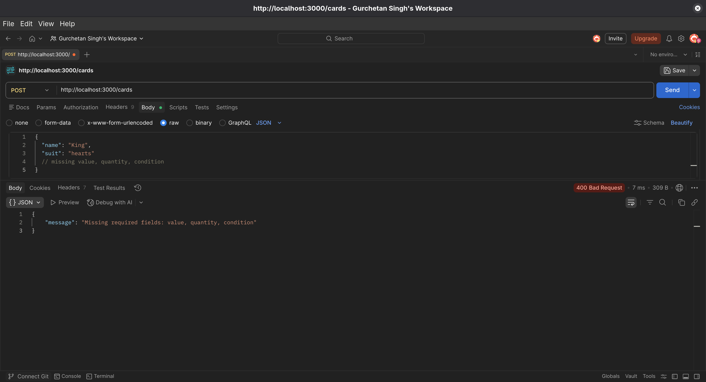

**Request:**
```
POST http://localhost:3000/cards
Content-Type: application/json

{
  "name": "King",
  "suit": "hearts"
  // missing value, quantity, condition
}
```

**Response:** (400 Bad Request)
```json
{
  "message": "Missing required fields: value, quantity, condition"
}
```

**Result:** ✅ Passed - Proper field validation with specific missing fields listed

---

### 3.3 Create Card with Empty Body (Validation Test)
**Endpoint:** `POST /cards`

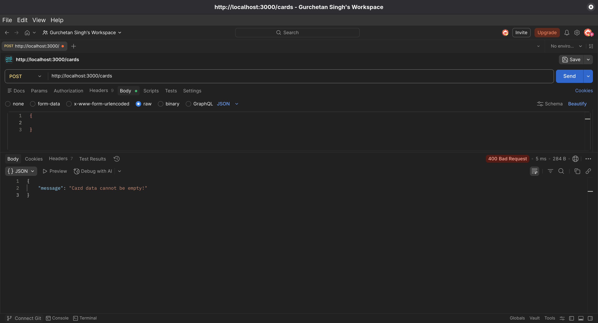

**Request:**
```
POST http://localhost:3000/cards
Content-Type: application/json

{}
```

**Response:** (400 Bad Request)
```json
{
  "message": "Card data cannot be empty!"
}
```

**Result:** ✅ Passed - Empty body validation working correctly

---

## 4. PUT Endpoints Testing

### 4.1 Update Existing Card by ID
**Endpoint:** `PUT /cards/:id`

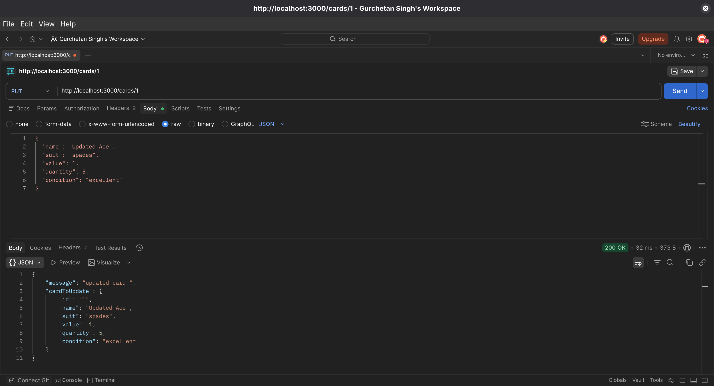

**Request:**
```
PUT http://localhost:3000/cards/1
Content-Type: application/json

{
  "name": "Updated Ace",
  "suit": "spades",
  "value": 1,
  "quantity": 5,
  "condition": "excellent"
}
```

**Response:** (200 OK)
```json
{
  "message": "updated card",
  "cardToUpdate": {
    "id": "1",
    "name": "Updated Ace",
    "suit": "spades",
    "value": 1,
    "quantity": 5,
    "condition": "excellent"
  }
}
```

**Result:** ✅ Passed - Card updated successfully

---

### 4.2 Update Non-existent Card
**Endpoint:** `PUT /cards/:id`

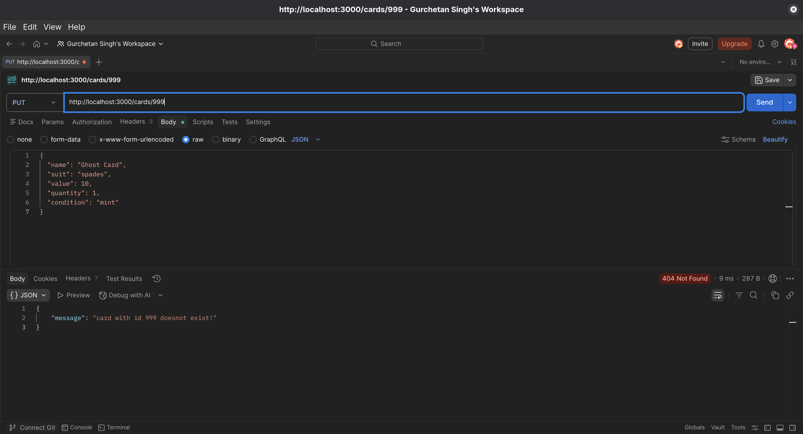

**Request:**
```
PUT http://localhost:3000/cards/999
Content-Type: application/json

{
  "name": "Ghost Card",
  "suit": "spades",
  "value": 10,
  "quantity": 1,
  "condition": "mint"
}
```

**Response:** (404 Not Found)
```json
{
  "message": "card with id 999 doesn't exist!"
}
```

**Result:** ✅ Passed - Proper 404 for non-existent card

---

### 4.3 Replace First Card with Second Card (Valid)
**Endpoint:** `PUT /cards/`

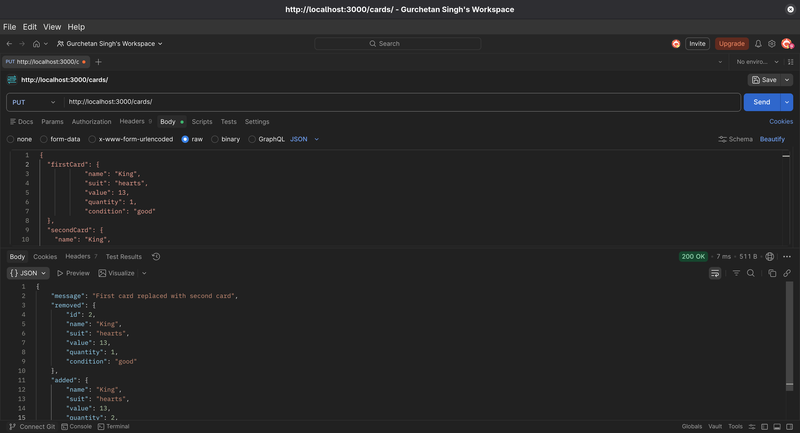

**Request:**
```
PUT http://localhost:3000/cards/
Content-Type: application/json

{
  "firstCard": {
    "name": "King",
    "suit": "hearts",
    "value": 13,
    "quantity": 1,
    "condition": "good"
  },
  "secondCard": {
    "name": "King",
    "suit": "hearts",
    "value": 13,
    "quantity": 2,
    "condition": "excellent"
  }
}
```

**Response:** (200 OK)
```json
{
  "message": "First card replaced with second card",
  "removed": {
    "id": 2,
    "name": "King",
    "suit": "hearts",
    "value": 13,
    "quantity": 1,
    "condition": "good"
  },
  "added": {
    "name": "King",
    "suit": "hearts",
    "value": 13,
    "quantity": 2,
    "condition": "excellent",
    "id": "550e8400-e29b-41d4-a716-446655440000"
  }
}
```

**Result:** ✅ Passed - Card replacement working correctly

---

### 4.4 Replace Card with Missing Second Card (Validation Test)
**Endpoint:** `PUT /cards/`

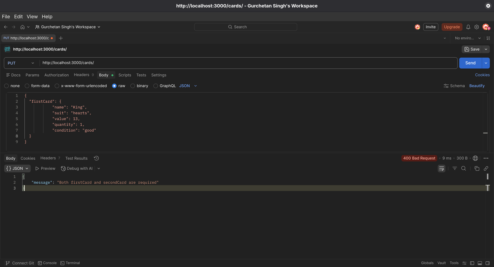

**Request:**
```
PUT http://localhost:3000/cards/
Content-Type: application/json

{
  "firstCard": {
    "name": "King",
    "suit": "hearts",
    "value": 13,
    "quantity": 1,
    "condition": "good"
  }
}
```

**Response:** (400 Bad Request)
```json
{
  "message": "Both firstCard and secondCard are required"
}
```

**Result:** ✅ Passed - Proper validation for replacement operation

---

## 5. DELETE Endpoints Testing

### 5.1 Delete Existing Card
**Endpoint:** `DELETE /cards/:id`

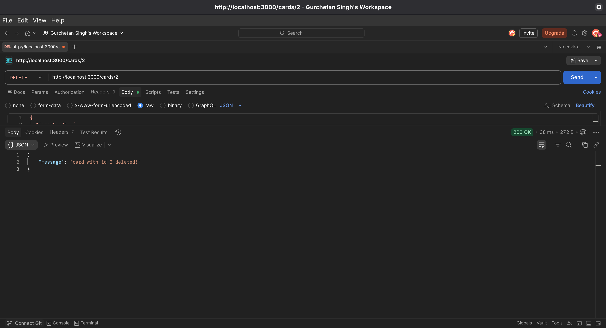

**Request:**
```
DELETE http://localhost:3000/cards/2
```

**Response:** (200 OK)
```json
{
  "message": "card with id 2 deleted!"
}
```

**Result:** ✅ Passed - Card deleted successfully

---

### 5.2 Delete Non-existent Card
**Endpoint:** `DELETE /cards/:id`

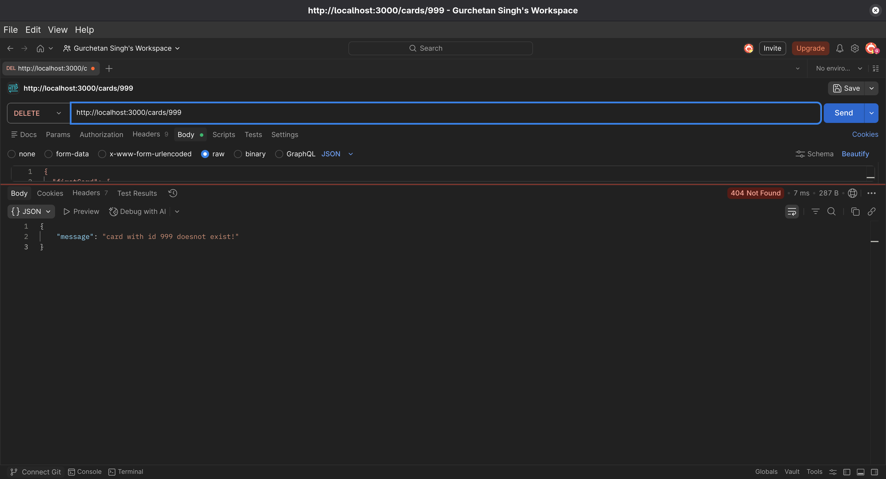

**Request:**
```
DELETE http://localhost:3000/cards/999
```

**Response:** (404 Not Found)
```json
{
  "message": "card with id 999 doesn't exist!"
}
```

**Result:** ✅ Passed - Proper 404 for non-existent card

---

## 6. Summary of Test Results

| Endpoint | Method | Test Case | Status | Screenshot |
|----------|--------|-----------|--------|------------|
| `/` | GET | Welcome message | ✅ PASS | `1.png` |
| `/cards` | GET | Get all cards | ✅ PASS | `2.png` |
| `/cards/1` | GET | Get card by ID | ✅ PASS | `3.png` |
| `/cards?suit=hearts` | GET | Filter by valid suit | ✅ PASS | `4.png` |
| `/cards?suit=invalid` | GET | Filter by invalid suit | ✅ PASS | `5.png` |
| `/cards/99` | GET | Non-existent card | ✅ PASS | `6.png` |
| `/cards` | POST | Create valid card | ✅ PASS | `7.png` |
| `/cards` | POST | Missing fields | ✅ PASS | `8.png` |
| `/cards` | POST | Empty body | ✅ PASS | `9.png` |
| `/cards/1` | PUT | Update card | ✅ PASS | `10.png` |
| `/cards/999` | PUT | Update non-existent | ✅ PASS | `11.png` |
| `/cards/` | PUT | Replace card | ✅ PASS | `12.png` |
| `/cards/` | PUT | Missing second card | ✅ PASS | `13.png` |
| `/cards/2` | DELETE | Delete card | ✅ PASS | `14.png` |
| `/cards/999` | DELETE | Delete non-existent | ✅ PASS | `15.png` |

---

## 7. Conclusion

All API endpoints have been successfully tested and are functioning as expected. Key observations:

✅ **All CRUD operations working correctly**
✅ **Proper HTTP status codes implemented** (200, 201, 400, 404)
✅ **Validation working for:**
   - Invalid suit queries
   - Missing required fields
   - Empty request bodies
   - Non-existent resources
✅ **UUID generation for new cards**
✅ **Card replacement functionality working**
✅ **Error messages are clear and helpful**

The Card Collection REST API is ready for production use.

---

**End of Report**